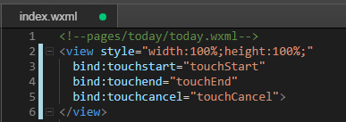
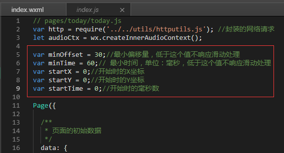
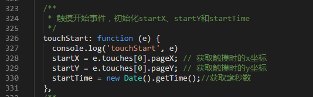
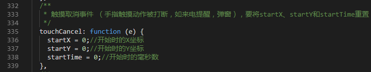
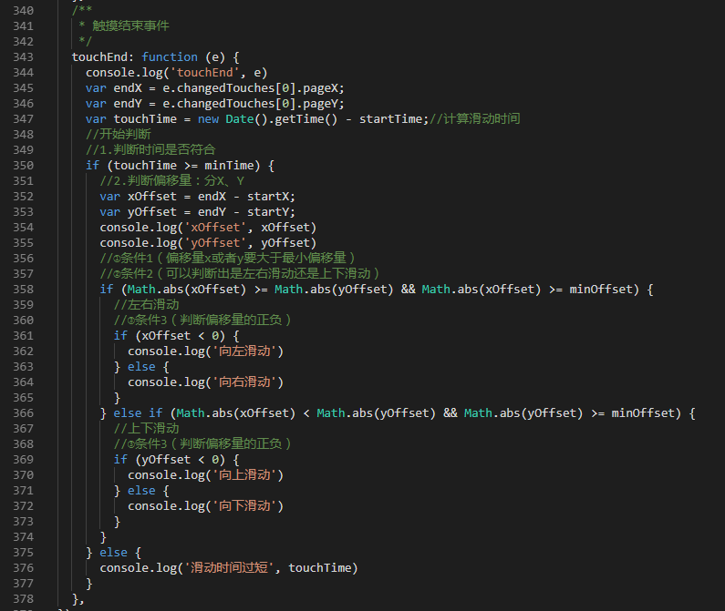
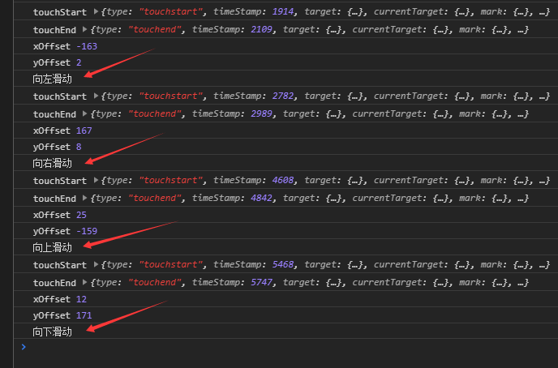

[toc](小程序滑动手势处理)

> 题外话：
>
> 1. 百度找了一圈没看到好用的，自己判断一下吧，顺便分享给大家。
> 2. 其实也就是判断到底是上下左右哪个方向的滑动啦。
> 3. 话说，我写这个的时候，到底是**滑动**，还是**划动**，这两个词纠结了好久~

### 1. 在wxml文件中绑定事件

绑定三个事件：`touchstart`、`touchend`、`touchcancel`，分别对应三个函数：`touchStart`、`touchEnd`、`touchCancel`

```xml
<!--pages/today/today.wxml-->
<view style="width:100%;height:100%;" 
  bind:touchstart="touchStart" 
  bind:touchend="touchEnd" 
  bind:touchcancel="touchCancel">
</view>
```

如图：



### 2. 在js文件中，对事件函数处理

###### 2.1 在Page外部，定义参数和变量；

```javascript
var minOffset = 30;//最小偏移量，低于这个值不响应滑动处理
var minTime = 60;// 最小时间，单位：毫秒，低于这个值不响应滑动处理
var startX = 0;//开始时的X坐标
var startY = 0;//开始时的Y坐标
var startTime = 0;//开始时的毫秒数
```

如图：



###### 2.2 触摸开始事件，初始化startX、startY和startTime；

这里主要是在手指刚触摸的屏幕的时候，获取最初的x、y坐标。我们把这个当做初始坐标。

```javascript
/**
   * 触摸开始事件，初始化startX、startY和startTime
   */
  touchStart: function (e) {
    console.log('touchStart', e)
    startX = e.touches[0].pageX; // 获取触摸时的x坐标  
    startY = e.touches[0].pageY; // 获取触摸时的x坐标
    startTime = new Date().getTime();//获取毫秒数
  },
```

如图：



###### 2.3 触摸取消事件

触摸取消事件：手指触摸动作被打断，如来电提醒，弹窗。

当触摸事件被取消中断的时候，要重置`startX`、`startY`、`startTime`三个的数值。

```javascript
/**
   * 触摸取消事件 （手指触摸动作被打断，如来电提醒，弹窗），要将startX、startY和startTime重置
   */
  touchCancel: function (e) {
    startX = 0;//开始时的X坐标
    startY = 0;//开始时的Y坐标
    startTime = 0;//开始时的毫秒数
  },
```

如图：



###### 2.4 触摸结束事件，主要的判断在这里；

> 注：这里注释较多，为了便于理解，强迫症可以删掉。

简单画了个分析手势类型的表格，便于理解。

| 图示 | 名称 | 条件1（偏移量x或者y要大于最小偏移量） | 条件2（可以判断出是左右滑动还是上下滑动） | 条件3（判断偏移量的正负） |
| :--: | :--: | :------------------------------------ | :---------------------------------------- | :------------------------ |
|  ←   | 左划 | Math.abs(偏移量 )>= minOffset         | Math.abs(x偏移量) > Math.abs(y偏移量)     | x偏移量 < 0               |
|  →   | 右划 | 同上                                  | 同左划                                    | x偏移量 > 0               |
|  ↑   | 上划 | 同上                                  | Math.abs(x偏移量) < Math.abs(y偏移量)     | y偏移量 < 0               |
|  ↓   | 下划 | 同上                                  | 同上划                                    | y偏移量 > 0               |

js代码如下：

```javascript
  /**
   * 触摸结束事件，主要的判断在这里
   */
  touchEnd: function (e) {
    console.log('touchEnd', e)
    var endX = e.changedTouches[0].pageX;
    var endY = e.changedTouches[0].pageY;
    var touchTime = new Date().getTime() - startTime;//计算滑动时间
    //开始判断
    //1.判断时间是否符合
    if (touchTime >= minTime) {
      //2.判断偏移量：分X、Y
      var xOffset = endX - startX;
      var yOffset = endY - startY;
      console.log('xOffset', xOffset)
      console.log('yOffset', yOffset)
      //①条件1（偏移量x或者y要大于最小偏移量）
      //②条件2（可以判断出是左右滑动还是上下滑动）
      if (Math.abs(xOffset) >= Math.abs(yOffset) && Math.abs(xOffset) >= minOffset) {
        //左右滑动
        //③条件3（判断偏移量的正负）
        if (xOffset < 0) {
          console.log('向左滑动')
        } else {
          console.log('向右滑动')
        }
      } else if (Math.abs(xOffset) < Math.abs(yOffset) && Math.abs(yOffset) >= minOffset) {
        //上下滑动
        //③条件3（判断偏移量的正负）
        if (yOffset < 0) {
          console.log('向上滑动')
        } else {
          console.log('向下滑动')
        }
      }
    } else {
      console.log('滑动时间过短', touchTime)
    }
  },
```

如图：



### 3. 测试滑动

尝试滑动，查看控制台。

如图：



至此，在微信小程序中，简单的手势滑动我们就已经实现了。